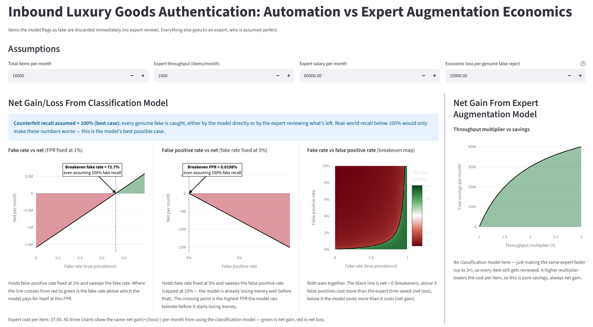

# Inbound Luxury Goods Authentication

I had the opportunity to learn of goods authentication problem.

What my client had in mind was a Machine Learning automation workflow to reduce expert labor for their current inbound.

```docker-compose up``` to try the dashboard.

### Before Machine Leaning

- All goods go through expert, who validates or rejects them.

### The requested ML workflow

- Classification ML helps auto-reject some items.
- The rest of the items still go through expert.
- Implied hard constraint is that no fake/counterfeit reaches inventory.

### What we know and don't

- Fake prevalence is **NOT** known.
- Data provenance/capture pipeline is **NOT YET** defined.
- Validating serial/QR with SKU and producer was **NOT** mentioned as part of the ML work.

## What a walk gave me

One day after the engagement, while taking a walk before dinner, I thought of the upsides and downsides of ML predictions, then I had Sonnet 5 (High) write me a simple Streamlit dashboard to crunch and show the numbers.

### The numbers argue against automatic classification ML

The cases are stacked against False Positive, a model flagging genuine item as fake. What a model flags gets thrown way or results in supplier dispute.

**One False Rejection per day is, by expected value, already more costly than any expert time it could save**, assuming the fake prevalence of single digits.



## What I'd propose

Instead, the leverage to reduce expert labor is **augmentation, not automation**. A system can speed up expert check by flagging where to look.

That said, whether the cases with absence of flags will result in expert complacency is another concern.

I'd focus on researching standard authentication practices, should this engagement continue.
